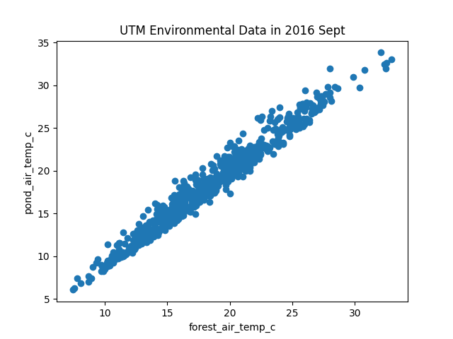
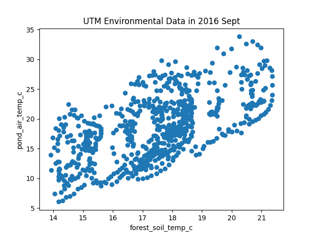
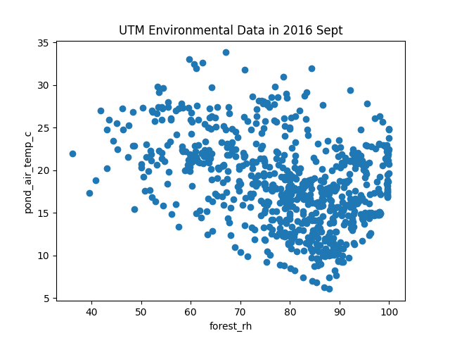
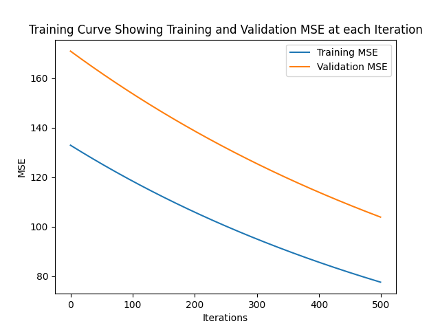
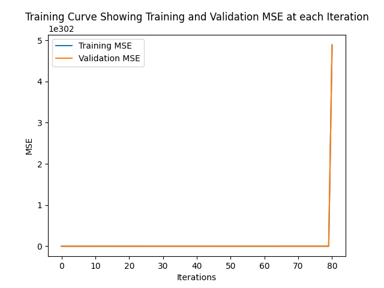
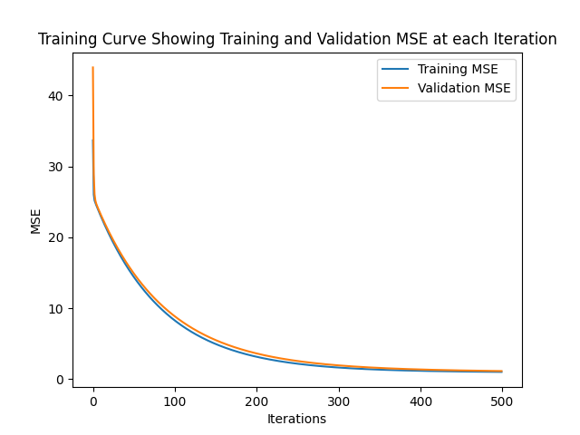
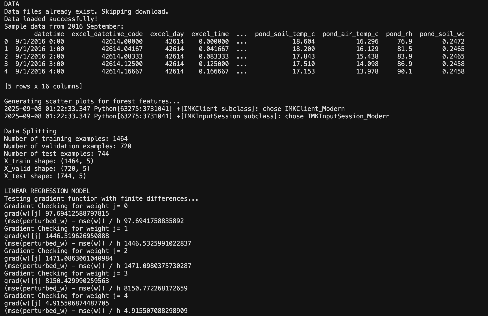
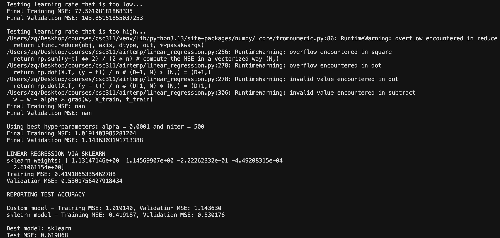

# Linear Regression (Air Temperature)

This project builds a linear regression model to predict **UTM pond air temperature** using measurements from the **UTM forest** (air temp, soil temp, relative humidity, soil water content). It includes a **custom gradient-descent implementation** and a **scikit-learn baseline**, plus visualization and train/validation/test evaluation.

> **Data source:** University of Toronto Mississauga meteorological station  
> https://www.utm.utoronto.ca/geography/resources/meteorological-station/environmental-datasets

## Features / What’s Included
- Auto-download of the dataset (`data.zip`) if required
- Time-aware split:
  - Train: Sept + Oct 2016
  - Valid: Sept 2017
  - Test: Oct 2017
- Custom linear regression: `pred`, `mse`, `grad`, `solve_via_gradient_descent`
- Gradient check with finite differences
- scikit-learn baseline (`LinearRegression` with `fit_intercept=False`)
- MSE curves for training/validation

## Requirements
- Python 3.9+  
- `numpy`, `pandas`, `matplotlib`, `scikit-learn`

## Outputs
**Scatter plots for forest features**

**Learning rate that is too low**

**Learning rate that is too high**

**Using best hyperparameters**

**Output**

